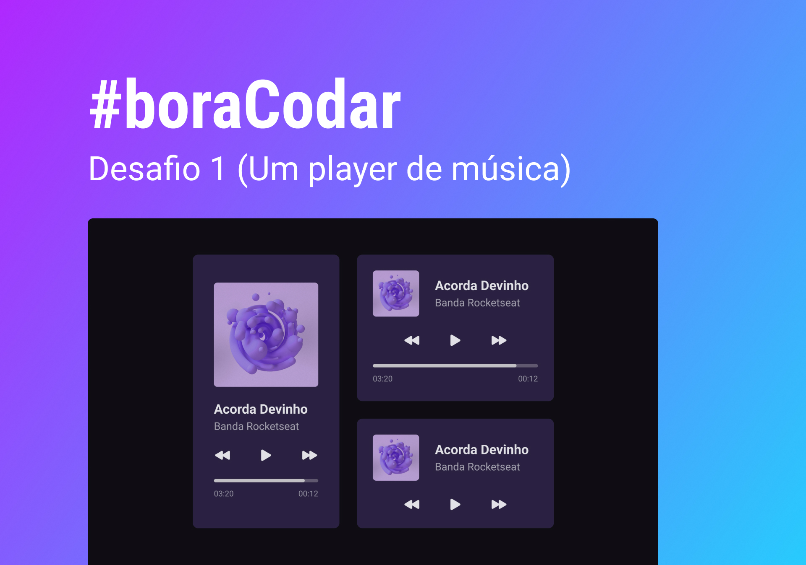

<h1 align="center"> Music Player </h1>

Desenvolvimento de um programa para ouvir músicas.  

  <a href="#-tecnologias">Tecnologias</a>&nbsp;&nbsp;&nbsp;|&nbsp;&nbsp;&nbsp;
  <a href="#-projeto">Projeto</a>&nbsp;&nbsp;&nbsp;|&nbsp;&nbsp;&nbsp;&nbsp;&nbsp;&nbsp;
  <a href="#memo-licença">Licença</a>

  

 

  

## 🚀 Tecnologias

Esse projeto foi desenvolvido com as seguintes tecnologias:

- HTML e CSS
- Git e Github
- Figma

## 💻 Projeto

O Music Player será um aplicativo para ouvir as suas músicas favoritas.

- [Acesse o andamento do projeto online](https://kellyernesto.github.io/Music-Player/)

## :memo: Licença

Esse projeto está sob a licença MIT.

---

Feito com ♥ Kelly :wave: [Comunidade Rocketseat!](https://discord.gg/rocketseat)